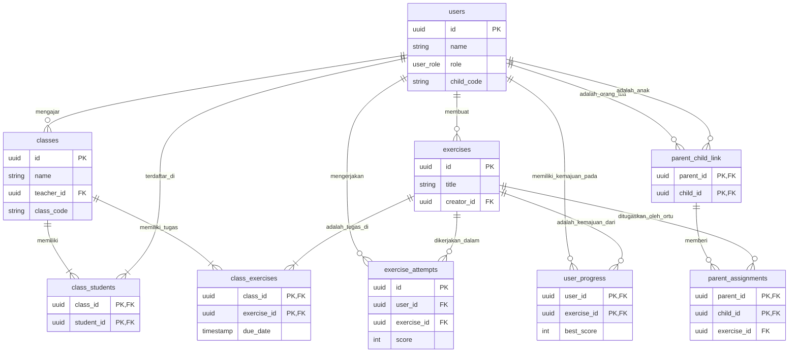

# Dokumentasi Backend EduWorksheets

Dokumen ini berfungsi sebagai referensi utama untuk arsitektur, skema, dan alur kerja backend aplikasi EduWorksheets. Tujuannya adalah untuk memastikan sinkronisasi antara tim frontend dan backend, serta menyediakan panduan yang jelas untuk pengembangan di masa depan.

## 1. Gambaran Umum & Diagram Relasi Entitas (ERD)

Backend aplikasi dibangun di atas Supabase, memanfaatkan PostgreSQL untuk database, Supabase Auth untuk manajemen pengguna, dan Supabase Functions untuk logika sisi server.

### Konsep Inti:

*   **Pengguna (Users):** Ada tiga peran utama: `teacher`, `student`, dan `parent`.
*   **Latihan (Exercises):** Konten pembelajaran yang dibuat oleh guru.
*   **Kelas (Classes):** Ruang virtual tempat guru dan siswa berinteraksi.
*   **Tugas (Assignments):** Latihan yang ditugaskan kepada kelas atau individu.
*   **Kemajuan (Progress):** Pelacakan kinerja siswa dalam mengerjakan latihan.
*   **Koneksi Orang Tua (Parent Links):** Mekanisme bagi orang tua untuk terhubung dengan akun anak mereka.

### Diagram ERD Sederhana:

---

## 2. Definisi Tabel Inti

Berikut adalah penjelasan untuk setiap tabel utama dalam database.

| Nama Tabel              | Deskripsi                                                                                             | Kolom Penting                                                                                             |
| ----------------------- | ----------------------------------------------------------------------------------------------------- | --------------------------------------------------------------------------------------------------------- |
| `users`                 | Menyimpan data profil untuk semua pengguna, terhubung ke `auth.users`.                                | `id`, `email`, `name`, `role` (`teacher`, `student`, `parent`), `child_code` (untuk siswa).               |
| `exercises`             | Katalog semua latihan yang dapat dibuat.                                                              | `id`, `title`, `subject`, `grade`, `difficulty`, `creator_id`, `is_public`, `questions` (JSONB).           |
| `questions`             | Menyimpan setiap pertanyaan dalam sebuah latihan.                                                     | `id`, `exercise_id`, `type`, `question` (teks), `options` (JSONB), `answer` (JSONB).                      |
| `classes`               | Mendefinisikan sebuah kelas virtual yang dikelola oleh seorang guru.                                  | `id`, `name`, `teacher_id`, `class_code` (unik untuk bergabung).                                           |
| `class_students`        | Tabel penghubung (junction table) antara `classes` dan `users` (siswa).                               | `class_id`, `student_id`.                                                                                 |
| `class_exercises`       | Tabel penghubung untuk menugaskan `exercises` ke `classes`.                                           | `class_id`, `exercise_id`, `due_date`, `max_attempts`, `time_limit`, `randomize_questions` (boolean), `show_answers_policy` (enum). |
| `exercise_attempts`     | Mencatat setiap upaya pengerjaan latihan oleh seorang siswa.                                          | `id`, `exercise_id`, `user_id`, `score`, `answers` (JSONB), `is_completed`, `submitted_at`, `class_id` (nullable). |
| `user_progress`         | **(Direvisi)** Mengagregasi kemajuan personal siswa pada sebuah latihan, terlepas dari konteks kelas. Direfactor melalui migrasi `20250720120000_refactor_progress_tracking.sql`. | `user_id`, `exercise_id`, `best_score_overall`, `attempts_count`, `is_mastered`.                          |
| `class_assignment_progress` | **(Baru)** Mengagregasi kemajuan siswa untuk tugas spesifik di dalam kelas. Dibuat melalui migrasi `20250720120000_refactor_progress_tracking.sql`. | `class_exercise_id`, `student_id`, `best_score`, `attempts_count`, `status`. |
| `parent_child_link`     | Menghubungkan akun `parent` dengan akun `student` melalui `child_code`.                               | `parent_id`, `child_id`.                                                                                  |
| `parent_assignments`    | Memungkinkan orang tua menugaskan latihan langsung kepada anak mereka.                                | `parent_id`, `child_id`, `exercise_id`.                                                                   |
| `parent_invitations`    | Mengelola proses undangan dari orang tua ke anak.                                                     | `parent_id`, `child_email`, `status` (`pending`, `accepted`, `declined`).                                 |
| `notifications`         | **(Direvisi)** Menyimpan notifikasi yang akan ditampilkan kepada pengguna. Skema disederhanakan dengan menghapus kolom `link` yang usang. | `user_id`, `message`, `is_read`, `type` (enum), `created_at`.                                              |
| `class_announcements`   | Pengumuman yang dibuat oleh guru untuk kelas tertentu.                                                | `class_id`, `teacher_id`, `message`.                                                                      |

---

## 3. Alur Kerja Utama (Workflows)

### Alur Kerja Guru

1.  **Membuat Kelas:**
    *   Guru membuat entri baru di tabel `classes`.
    *   Sebuah `class_code` unik secara otomatis dibuat oleh fungsi `generate_class_code()`.
2.  **Mengundang Siswa:**
    *   Guru membagikan `class_code` kepada siswa.
3.  **Membuat Latihan:**
    *   Guru membuat entri baru di tabel `exercises`.
    *   Pertanyaan-pertanyaan untuk latihan disimpan dalam format JSON di kolom `questions`.
4.  **Menugaskan Latihan ke Kelas:**
    *   Guru membuat entri di `class_exercises` yang menghubungkan `classes.id` dengan `exercises.id`.
    *   Guru dapat menetapkan `due_date`, `max_attempts`, dan pengaturan lainnya.
5.  **Memantau Kemajuan:**
    *   Guru dapat melihat data dari `exercise_attempts` dan `user_progress` untuk semua siswa di kelasnya, difilter berdasarkan `class_id`.
    *   Kebijakan RLS memastikan guru hanya bisa melihat data siswa di kelas yang dia ajar.

### Alur Kerja Siswa

1.  **Bergabung dengan Kelas:**
    *   Siswa memasukkan `class_code` yang diberikan oleh guru.
    *   Aplikasi mencari `classes` berdasarkan `class_code` dan membuat entri baru di `class_students` yang menghubungkan `student_id` siswa dengan `class_id` yang ditemukan.
2.  **Melihat Tugas:**
    *   Aplikasi mengambil semua entri dari `class_exercises` yang terkait dengan `class_id` tempat siswa terdaftar.
3.  **Mengerjakan Latihan:**
    *   Saat siswa mulai mengerjakan, sebuah entri baru dibuat di `exercise_attempts`.
    *   Jawaban siswa disimpan di kolom `answers` (JSONB).
    *   Setelah selesai, `is_completed` dan `is_submitted` diatur ke `true`, dan `score` dihitung.
4.  **Memicu Pembaruan Kemajuan:**
    *   Sebuah *trigger* pada tabel `exercise_attempts` akan memanggil fungsi `update_user_progress()`.
    *   Fungsi ini akan membuat atau memperbarui entri di `user_progress`, mencatat skor terbaik, jumlah percobaan, dll.
5.  **Melihat Hasil:**
    *   Siswa melihat data dari `user_progress` dan `exercise_attempts` miliknya sendiri.

### Alur Kerja Orang Tua

1.  **Menghubungkan Akun Anak:**
    *   Orang tua meminta `child_code` dari anaknya (yang tersedia di profil siswa).
    *   Orang tua memasukkan kode tersebut. Aplikasi memvalidasi kode dan membuat entri di `parent_child_link`.
    *   *Alternatif:* Orang tua mengirim undangan melalui `parent_invitations` menggunakan email anak. Anak harus menerima undangan tersebut.
2.  **Memberikan Tugas:**
    *   Orang tua dapat menelusuri latihan publik (`is_public = true`).
    *   Orang tua membuat entri di `parent_assignments` untuk menugaskan latihan ke anak.
3.  **Memantau Laporan Anak:**
    *   Orang tua dapat melihat data `user_progress` anak mereka. Kebijakan RLS memberikan akses baca jika ada hubungan yang valid di `parent_child_link`.

---

## 4. Fungsi & Otomatisasi Database

*   `handle_new_user()`: **SECURITY DEFINER**. Dijalankan oleh *trigger* saat ada pengguna baru di `auth.users`. Secara otomatis membuat entri yang sesuai di `public.users`, mengekstrak nama dan peran dari metadata.
*   `generate_class_code()`: Membuat kode alfanumerik 8 karakter yang unik untuk kelas baru.
*   `update_user_progress()`: **(USANG)**. Fungsi ini telah digantikan oleh `handle_exercise_attempt_update()` melalui migrasi `20250720120000_refactor_progress_tracking.sql`.
    *   **Catatan Sejarah (20 Juli 2025):** Ditemukan bahwa *trigger* yang memanggil fungsi ini tidak pernah didefinisikan dalam migrasi skema awal. *Trigger* ini ditambahkan secara eksplisit melalui migrasi `20250720080500_add_trigger_for_user_progress.sql` untuk memperbaiki bug di mana kemajuan siswa tidak direkam.
    *   **Catatan Sejarah (20 Juli 2025):** Fungsi ini diperbarui secara signifikan melalui migrasi `20250720090000_update_user_progress_function.sql`. Pembaruan ini menambahkan logika krusial untuk:
        1.  Mengambil `minimum_passing_grade` dari `class_exercises` atau `exercises`.
        2.  Membandingkan skor siswa dengan `minimum_passing_grade`.
        3.  Mengatur kolom `status` di `user_progress` menjadi `completed_passed` atau `completed_failed`, sehingga menyelesaikan bug di mana status kemajuan tidak diperbarui dengan benar.
*   `handle_exercise_attempt_update()`: **(Baru)** **SECURITY DEFINER**. Fungsi trigger baru yang menggantikan `update_user_progress`. Dijalankan setelah `exercise_attempts` dibuat. Fungsi ini memiliki peran ganda:
    1.  **Selalu** memperbarui tabel `user_progress` untuk melacak kemajuan personal siswa secara keseluruhan.
    2.  **Jika** pengerjaan berasal dari tugas kelas (`class_id` tidak NULL), fungsi ini juga akan memperbarui tabel `class_assignment_progress` yang baru untuk laporan nilai guru.
    *   **Catatan Implementasi:** Dibuat dan diaktifkan melalui migrasi `20250720120000_refactor_progress_tracking.sql`.
*   `generate_unique_child_code()`: Membuat kode 6 karakter yang unik untuk siswa baru, yang digunakan oleh orang tua untuk menautkan akun.
*   `get_my_classes()`: **SECURITY DEFINER**. Fungsi RPC yang direkomendasikan untuk mengambil daftar kelas untuk pengguna yang sedang login. Fungsi ini menyelesaikan masalah RLS rekursif dengan memeriksa peran pengguna (guru atau siswa) dan mengembalikan data yang sesuai, termasuk jumlah siswa per kelas.
*   `get_class_details()`: **SECURITY DEFINER**. Fungsi RPC yang harus digunakan untuk mengambil detail satu kelas. Fungsi ini secara aman mengambil data kelas dan jumlah siswa, menghindari konflik RLS yang kompleks.
    *   **Catatan Sejarah (19 Juli 2025):** Fungsi ini mengalami regresi kritis karena migrasi `20250718210000` yang menambahkan `JOIN` kompleks, menyebabkan error RLS. Masalah ini diperbaiki secara definitif oleh migrasi `20250719181000_realign_get_class_details_rpc_schema.sql`, yang mengembalikan fungsi ini ke versi stabilnya yang **tidak** melakukan `JOIN` apa pun.
*   `get_user_role()`: Fungsi helper yang mengambil peran pengguna dari JWT.
*   `is_class_member()`: **SECURITY DEFINER**. Fungsi helper yang memeriksa apakah seorang siswa terdaftar di kelas tertentu, digunakan dalam kebijakan RLS.
*   `is_teacher_of_class()`: **SECURITY DEFINER**. Fungsi helper yang memeriksa apakah pengguna saat ini adalah guru dari kelas yang ditentukan. Dibuat untuk mengatasi masalah RLS yang persisten pada tabel `class_exercises`. Digunakan dalam kebijakan `INSERT` untuk memastikan hanya guru yang berwenang yang dapat menugaskan latihan.
*   `handle_notification_creation()`: **(Direvisi)** Fungsi trigger terpusat yang dipanggil saat ada event penting (tugas baru, pengumuman, pengerjaan tugas). Fungsi ini secara cerdas membuat notifikasi yang relevan untuk semua pihak terkait (siswa, guru, orang tua).
    *   **Catatan Sejarah Kritis (20 Juli 2025):** Ditemukan bahwa fungsi ini tidak terdokumentasi dalam file migrasi dan mengandung logika usang yang menyebabkan error kritis pada saat pengiriman tugas siswa. Fungsi ini secara keliru mencoba memasukkan data ke dalam kolom `link` yang sudah tidak ada di tabel `notifications`. Masalah ini diperbaiki secara definitif melalui migrasi `20250720232000_remove_link_from_central_notification_trigger.sql`, yang menulis ulang fungsi ini sepenuhnya. Error lanjutan terkait `ENUM` yang hilang (`assignment_graded`) juga diperbaiki melalui `20250720232500_add_graded_to_notification_enum.sql`. Lihat `study_case_student_submission_fix.md` untuk analisis lengkap.
*   `check_overdue_assignments()`: Fungsi yang dirancang untuk dijalankan sebagai cron job harian. Fungsi ini memindai semua tugas yang telah melewati tenggat waktu tetapi belum dikerjakan, lalu mengirimkan notifikasi keterlambatan kepada siswa, guru, dan orang tua yang bersangkutan.
*   `get_child_active_assignments(p_child_id)`: **SECURITY DEFINER**. Fungsi RPC yang digunakan oleh dasbor orang tua untuk mendapatkan daftar gabungan semua tugas aktif seorang anak. Fungsi ini secara aman menggabungkan data dari `parent_assignments` dan `class_exercises`, lalu memfilternya berdasarkan `user_progress` untuk hanya menampilkan tugas yang belum dikerjakan.
*   `get_teacher_class_exercises(p_class_id)`: **SECURITY DEFINER**. Fungsi RPC yang digunakan oleh halaman detail kelas guru untuk mengambil semua latihan yang ditugaskan ke kelas tersebut. Fungsi ini menyertakan validasi untuk memastikan hanya guru dari kelas tersebut yang dapat memanggilnya, dan juga menghitung jumlah siswa yang telah mengerjakan setiap tugas.
    *   **Catatan Sejarah (20 Juli 2025):** Fungsi ini diperbaiki melalui migrasi `20250720140000_fix_get_teacher_class_exercises_rpc.sql` untuk mengatasi error `column up.class_id does not exist`. Perbaikan ini mengalihkan subquery penghitungan dari tabel `user_progress` yang usang ke tabel `class_assignment_progress` yang baru, menyelaraskannya dengan arsitektur pelacakan kemajuan pasca-refactoring. Lihat `study_case_teacher_class_exercise_stale_rpc.md`.
*   `get_student_class_assignments(p_class_id)`: **SECURITY DEFINER**. Fungsi RPC yang dirancang khusus untuk halaman detail kelas siswa. Fungsi ini secara aman mengambil semua latihan yang ditugaskan ke kelas, melakukan `LEFT JOIN` dengan `user_progress` untuk menyertakan status kemajuan siswa (`not-started`, `in-progress`, `completed`, dll.) untuk setiap tugas. Validasi memastikan hanya siswa yang menjadi anggota kelas yang dapat memanggil fungsi ini.
    *   **Catatan Sejarah (Juli 2025):** Fungsi ini diperbarui melalui migrasi `20250719160000_fix_student_assignments_enum_cast.sql` untuk memperbaiki bug tipe data. Versi awal secara tidak sengaja mengembalikan kolom `status` sebagai `text` bukan `progress_status_enum`, yang menyebabkan error `invalid input value for enum`. Perbaikan dilakukan dengan mengubah tipe data yang dikembalikan oleh fungsi dan secara eksplisit melakukan cast `COALESCE(up.status, 'not-started'::progress_status_enum)` untuk memastikan konsistensi tipe data.
    *   **Catatan Sejarah (20 Juli 2025):** Fungsi ini diperbaiki kembali melalui migrasi `20250720150000_fix_get_student_class_assignments_rpc.sql` untuk mengatasi error `column up.class_id does not exist`. Perbaikan ini mengalihkan `LEFT JOIN` dari tabel `user_progress` yang usang ke tabel `class_assignment_progress` yang baru, menyelaraskannya dengan arsitektur pelacakan kemajuan pasca-refactoring. Lihat `study_case_student_assignment_error.md`.
*   `submit_exercise_attempt()`: **SECURITY DEFINER**. Fungsi RPC yang dibuat untuk menangani penyimpanan pengerjaan soal dari frontend. Fungsi ini menerima semua detail pengerjaan dan melakukan `INSERT` yang aman di sisi server. Ini dibuat untuk mengatasi error `INSERT` dari frontend yang mencoba mengisi *generated column* (`percentage`) dan untuk memisahkan logika klien dari skema tabel.
    *   **Catatan Implementasi:** Dibuat melalui migrasi `20250720100000_create_submit_exercise_attempt_rpc.sql`.
    *   **Catatan Sejarah (20 Juli 2025):** Fungsi ini diperbaiki secara kritis melalui migrasi `20250720160000_fix_submit_exercise_attempt_rpc.sql`. Perbaikan ini mengganti parameter `p_class_id` yang usang dengan `p_class_exercise_id` dan memperbaiki fungsi trigger `handle_exercise_attempt_update` untuk menggunakan kolom yang benar, sehingga menyelesaikan bug fatal di mana pengerjaan siswa gagal disimpan. Lihat `study_case_student_submission_fix.md`.

---

## 5. Views & RPC Penting

### `classes_with_student_count` (VIEW)
View ini dibuat untuk menyederhanakan query dari sisi klien dengan menggabungkan data dari tabel `classes` dengan jumlah siswa (`student_count`) dari `class_students`. View ini menggunakan `security_invoker = true`, yang berarti ia akan menerapkan kebijakan RLS dari tabel `classes` dan `class_students` berdasarkan siapa yang memanggilnya.

### `get_my_classes()` (RPC)
Ini adalah metode utama yang harus digunakan oleh frontend untuk mengambil daftar kelas yang relevan bagi pengguna saat ini. Fungsi ini secara efisien menangani logika untuk guru dan siswa, dan yang terpenting, menghindari masalah RLS rekursif yang sebelumnya terjadi saat mencoba mengambil data kelas beserta jumlah siswanya secara bersamaan.

### `get_class_details()` (RPC)
Ini adalah metode yang harus digunakan oleh frontend untuk mengambil detail satu kelas. Karena adanya kebijakan RLS yang ketat pada tabel `users`, fungsi ini sengaja tidak melakukan `JOIN` untuk mengambil nama guru. **Praktik terbaik yang telah divalidasi adalah memanggil `rpc('get_class_details')` terlebih dahulu, lalu melakukan panggilan terpisah ke `getUserProfile` (untuk guru) dan `getClassStudents` (untuk siswa) dari frontend.**

### Fungsi Pelaporan (RPCs)
Serangkaian fungsi `SECURITY DEFINER` ini ditambahkan pada Juli 2025 untuk mendukung fitur pelaporan yang komprehensif.

*   **`get_student_class_report(p_student_id, p_class_id)`:** Menghasilkan laporan ringkas tentang partisipasi dan kinerja seorang siswa dalam satu kelas tertentu. Ideal untuk digunakan di dasbor orang tua.
*   **`get_teacher_class_dashboard(p_class_id)`:** Mengagregasi data kinerja untuk semua latihan dalam satu kelas, menampilkan metrik seperti skor rata-rata dan tingkat partisipasi. Dirancang untuk laporan kelas guru.
*   **`get_class_grades_report(p_class_id)`:** **(Baru/Direvisi)** Fungsi RPC utama untuk fitur "Laporan Nilai" guru. Fungsi ini secara aman mengambil data laporan nilai yang sudah diproses dari tabel `class_assignment_progress` yang baru.
    *   **Catatan Implementasi:** Dibuat ulang dan disempurnakan melalui migrasi `20250720130000_create_get_class_grades_report_rpc.sql` untuk mendukung arsitektur pelacakan kemajuan yang baru.
*   **`get_student_exercise_details(p_student_id, p_class_exercise_id)`:** Mengambil riwayat lengkap semua upaya yang dilakukan oleh seorang siswa pada satu tugas kelas tertentu, memungkinkan analisis mendalam.
*   **`get_class_student_reports(p_class_id)`:** **SECURITY DEFINER**. Mengambil laporan gabungan untuk semua siswa dalam satu kelas. Fungsi ini secara aman melakukan join antara `class_students`, `users`, dan `exercise_attempts` untuk mengembalikan nama siswa beserta semua percobaan latihan mereka dalam kelas tersebut. Didesain untuk halaman laporan siswa guru dan menyertakan validasi untuk memastikan hanya guru dari kelas tersebut yang dapat memanggilnya.
*   **`get_class_exercise_details_for_teacher(p_class_id, p_exercise_id)`:** **SECURITY DEFINER**. Fungsi kritis yang dirancang untuk mengatasi masalah regresi akses data guru. Fungsi ini memungkinkan guru untuk secara aman mengambil detail lengkap dari satu latihan (termasuk semua pertanyaan) dalam konteks kelas tertentu. Fungsi ini melakukan validasi ganda: memastikan pengguna adalah guru dari kelas tersebut dan latihan tersebut memang ditugaskan ke kelas itu. Ini adalah metode yang disarankan untuk digunakan setiap kali frontend memerlukan data latihan yang komprehensif untuk peran guru, menghindari masalah RLS yang kompleks.
    *   **Catatan Implementasi:** Fungsi ini dibuat melalui migrasi `20250719190000_create_get_class_exercise_details_for_teacher_rpc.sql`.
    *   **Catatan Sejarah (20 Juli 2025):** Fungsi ini mengalami serangkaian perbaikan melalui migrasi `20250720002100_fix_get_class_exercise_details_for_teacher_rpc.sql` untuk mengatasi berbagai error ketidakcocokan skema. Perbaikan ini mencakup:
        1.  Mengganti nama kolom yang salah (`views` -> `view_count`, `ratings` -> `like_count`).
        2.  Menyesuaikan dengan refactoring tabel `class_exercises` di mana kolom `settings` (JSONB) digantikan oleh kolom-kolom individual (`time_limit`, `max_attempts`, `randomize_questions`, `show_answers_policy`).
        3.  Mengkoreksi tipe data ENUM yang salah (`curriculum_type_enum` -> `curriculum_type`) untuk memastikan struktur `RETURNS TABLE` cocok 100% dengan hasil query `SELECT`.

---

## 6. Aturan Keamanan (Row Level Security - RLS)

RLS diaktifkan di semua tabel inti untuk memastikan pengguna hanya dapat mengakses data yang diizinkan.

*   **Users:** Pengguna hanya dapat melihat dan mengedit profil mereka sendiri.
*   **Classes & Class Students:** Kebijakan RLS di sini sangat penting. Guru dapat mengelola kelas yang mereka buat dan semua siswa di dalamnya. Siswa hanya dapat melihat kelas tempat mereka terdaftar dan hanya dapat mengelola keanggotaan mereka sendiri.
    *   **Catatan Sejarah (Juli 2025):** Terjadi masalah RLS rekursif yang signifikan saat mencoba mengambil data kelas beserta jumlah siswanya. Masalah ini diselesaikan dengan membuat fungsi RPC `get_my_classes()` yang menggunakan `SECURITY DEFINER` untuk melewati RLS yang bertentangan untuk query spesifik ini. **Praktik terbaik saat ini adalah menggunakan `rpc('get_my_classes')` dari frontend untuk mengambil data kelas.**
*   **Exercises:** Pengguna dapat mengelola latihan yang mereka buat. Latihan publik (`is_public = true`) dapat dilihat oleh semua pengguna terotentikasi.
    *   **Catatan Akses Publik (20 Juli 2025):** Untuk mendukung fitur berbagi latihan secara publik kepada pengguna yang tidak login (`anon`), kebijakan RLS khusus telah diterapkan melalui migrasi `20250720010000_fix_public_exercise_access.sql`. Kebijakan ini memberikan akses `SELECT` kepada peran `anon` dan `authenticated` pada tabel `exercises` dan `questions` jika `exercises.is_public = true`.
    *   Untuk mencegah crash di frontend ketika data kreator tidak dapat diambil karena RLS, fungsi `supabaseService.getExerciseWithQuestions` telah dimodifikasi untuk menangani `creator` yang `null` dengan aman, memberikan nama default "Pengguna Publik".
*   **Class Members & Progress:** Guru hanya dapat melihat data siswa dan kemajuan di dalam kelas mereka. Siswa hanya dapat melihat data mereka sendiri.
*   **Class Exercises:** Kebijakan `INSERT` pada tabel ini diperbaiki pada 20 Juli 2025 untuk mengatasi error "violates row-level security policy". Solusi final menggunakan fungsi helper `is_teacher_of_class()` untuk memvalidasi bahwa hanya guru dari kelas tersebut yang dapat menugaskan latihan. Migrasi yang relevan adalah `20250720014000_fix_class_exercise_rls_with_helper_function.sql`.
*   **Parent Links & Progress:** Orang tua hanya dapat melihat data anak yang terhubung dengan mereka.

Dokumen ini harus diperbarui setiap kali ada perubahan signifikan pada skema atau logika backend.
